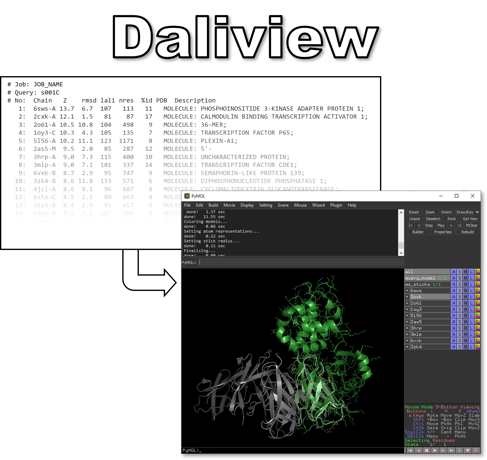
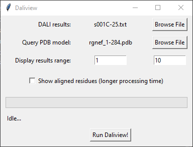
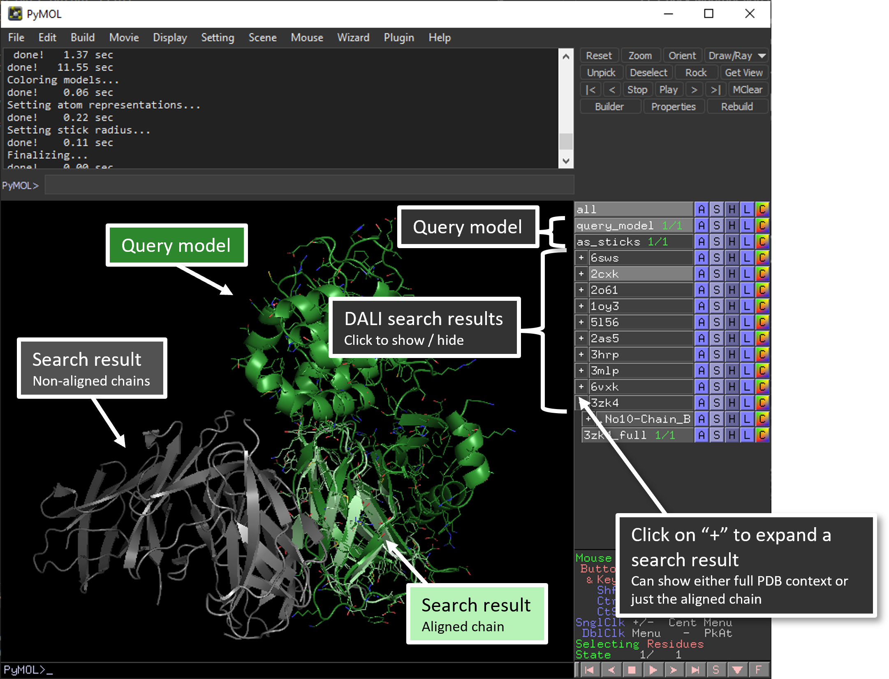

DALIview is a simple script that reads the output of a [DALI](http://ekhidna2.biocenter.helsinki.fi/dali/) structure comparison search and visually displays the top alignment results in PyMOL.

---
## Prerequisites
- [PyMOL v2.0+](https://pymol.org/)


---
## Basic Usage

1. Download [`daliview.py`](daliview.py)
2. Run a [DALI search](http://ekhidna2.biocenter.helsinki.fi/dali/) on your query PDB. It must be a single chain!
3. Download the DALI output text file. It should look something like this:
    * `s001C-25.txt`
```
# Job: JOB_NAMEs
# Query: s001C
# No:  Chain   Z    rmsd lali nres  %id PDB  Description
   1:  6sws-A 13.7  6.7  107   113   11   MOLECULE: PHOSPHOINOSITIDE...;               
   2:  2cxk-A 12.1  1.5   81    87   17   MOLECULE: CALMODULIN BINDI...;              
   3:  2o61-A 10.5 10.8  104   498    9   MOLECULE: 36-MER;                                                    
   4:  1oy3-C 10.3  4.3  105   135    7   MOLECULE: TRANSCRIPTION FA...;                                  
   5:  5l56-A 10.2 11.1  123  1171    8   MOLECULE: PLEXIN-A1;                                                 
   6:  2as5-M  9.5  2.0   85   287   12   MOLECULE: 5'-                                                        
   7:  3hrp-A  9.0  7.3  115   400   10   MOLECULE: UNCHARACTERIZED ...;                                   
   8:  3mlp-A  9.0  7.1  101   337   14   MOLECULE: TRANSCRIPTION FA...;                                 
   9:  6vxk-B  8.7  2.9   95   747    9   MOLECULE: SEMAPHORIN-LIKE ...;                               
  10:  3zk4-B  8.6 11.8  133   571    6   MOLECULE: DIPHOSPHONUCLEOT...;                         


[...]

-matrix  "s001-C 3s4s-H  U(2,.)   0.082989 -0.995537 -0.044937  -6.485153"
-matrix  "s001-C 3s4s-H  U(3,.)  -0.942542 -0.063768 -0.327946   5.962400"
-matrix  "s001-C 2ckn-A  U(1,.)  -0.404600 -0.536010  0.740940  -1.525906"
-matrix  "s001-C 2ckn-A  U(2,.)  -0.342883 -0.662195 -0.666280   5.914645"
-matrix  "s001-C 2ckn-A  U(3,.)   0.847780 -0.523633  0.084135  -4.194786"
-matrix  "s001-C 3wo4-B  U(1,.)   0.878015 -0.287889  0.382374  13.980225"
-matrix  "s001-C 3wo4-B  U(2,.)  -0.229703  0.447428  0.864317 -29.445488"
-matrix  "s001-C 3wo4-B  U(3,.)  -0.419913 -0.846716  0.326719 -40.823536"
-matrix  "s001-C 6jo8-N  U(1,.)   0.589557  0.778749 -0.214410 -86.035217"
-matrix  "s001-C 6jo8-N  U(2,.)  -0.614442  0.260088 -0.744859  41.696270"
-matrix  "s001-C 6jo8-N  U(3,.)  -0.524293  0.570880  0.631833  -6.515020"

```
4. You should have 3 files: 
    * Input PDB file (the **exact** file that was uploaded to DALI)
    * DALI results file
    * daliview.py
5. Open PyMOL
6. `File` > `Run Script...`
7. Navigate to `daliview.py` script.
8. The Daliview input window should open: 

9. Browse to the DALI input PDB file and the DALI results file. 
10. Select a range of structures to display (Corresponds to the numbering in the DALI output file). 
11. Check whether you would like to display residue alignment details. This does not affect how structures are aligned, only how they are displayed. 
12. Click Run. The window will close when the run is complete. 

---
## PyMOL output window



---
## Credits

[Daliview](daliview.py) was written by Robert Szabla of the [Junop Lab](https://junoplab.wordpress.com/) at Western Univerity. 

The [DALI server](http://ekhidna2.biocenter.helsinki.fi/dali/) is created and maintained by the Holm group at University of Helsinki. 

> Holm L (2022) [Dali server: structural unification of protein families](https://doi.org/10.1093/nar/gkac387). Nucleic Acids Research 50, W210-W215.

[PyMOL](https://pymol.org/) is maintained and distributed by Schrödinger. 


---
## License 
Daliview is licensed under the GNU General Public License V3.0. 